## GC 日志分析与垃圾回收器分析

## 准备

​	实验代码： GCLogAnalysis.java, 

​	使用内存大小：128m， 512m，1G，2G， 4G， 8G

​	GC： serial， parrallel， CMS ，G1

---

### SerialGC（串行GC）

serial + 128m

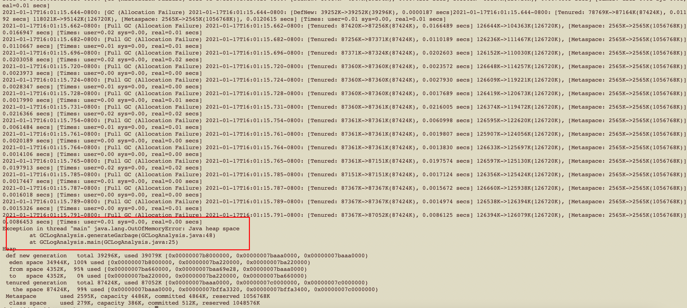

内存溢出，堆空间太小。

---

serialGC + 512m

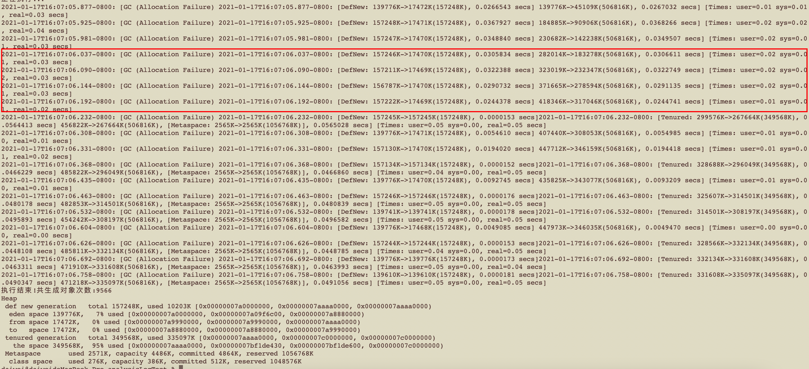

512m 的堆大小并没有造成堆溢出的情况，但是从GC次数上来看，一共进行了18次的GC 其中包括 7次的 fullGC 且随着时间的增加，后面 fullGC 也逐渐频繁起来。随机从图中圈出一部分GC 数据可以不难算出一以下结论：

| Event | Time | Young before | Young after | young decreased | total decreased | Allcation rate | Promote rate |
| :---: | ---- | ------------ | ----------- | --------------- | --------------- | -------------- | ------------ |
| GC#1  | 56ms | 157246kb     | 17470kb     | 139776kb        | 98736kb         | 1721Mb/s       | 716Mb/s      |
| GC#2  | 53ms | 157211kb     | 17469kb     | 138742kb        | 90672kb         | 2556Mb/s       | 1671Mb/s     |
| GC#3  | 48ms | 157222kb     | 17569kb     | 139753kb        | 101600kb        | 2843Mb/s       | 2067Mb/s     |

从上面的表格中不难看出，GC 的间隔时间已经非常平凡，平均 50ms 就要触发一次 young gc，`分配速率(Allcation rate)也非常的高，并分配速率在不断的提高且垃圾回收速率基本等于分配速率`，表中的提升速率(Promote rate)，也处于一个比较高的值且不断增大，这意味着，每次gc 完成会有大量的对象从 young区晋升到 old 区。同时，从日志中可以看到，GC#3之后系统发生了一次也是第一次 fullGC，但是随着代码的运行，其中后面9次的 GC 操作包括了，最后可以看到old 区的使用率已经到了 95%，且最后发生的一次 gc 是fullGC 并且最后几次 GC 并没有 发生什么实质性的垃圾回收工作，**可以预见，jvm 已经到了极限，如果程序再稍微运行一段时间必定会发生 OOM**。在 512M 这个档，内存空间较小，gc 速度没有明显的减慢。

---

serialGC + 1G

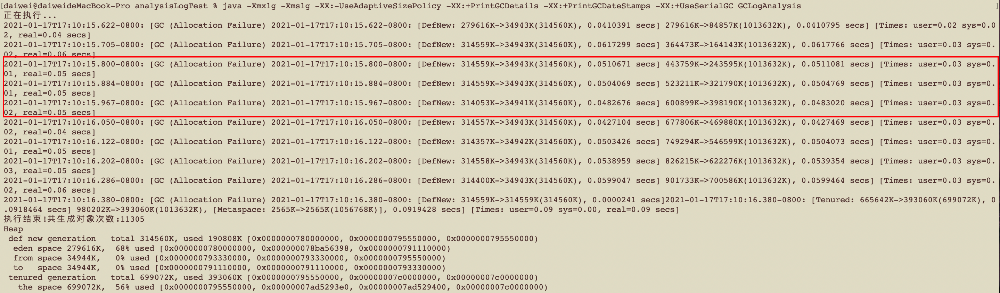

将 jvm 堆大小调整到 1G，整个 jvm 在大内存的影响下，GC 频率明显下降，从512m内存的18(9+7)次GC 降到了 10(9+1)次GC，并且代码在运行过程中产生了 11305个对象，相较于 512m 也有一定的提升。但是GC持续时间明显增加。

| Event | Time | Young before | Young after | young decreased | total decreased | Allcation rate | Promote rate |
| :---: | ---- | ------------ | ----------- | --------------- | --------------- | -------------- | ------------ |
| GC#1  | 95ms | 314559kb     | 34943kb     | 279616kb        | 200164kb        | 2874Mb/s       | 816Mb/s      |
| GC#2  | 84ms | 314559kb     | 34943kb     | 279616kb        | 201421kb        | 3250Mb/s       | 909Mb/s      |
| GC#3  | 83ms | 314053kb     | 34914kb     | 279139kb        | 202709kb        | 3284Mb/s       | 899Mb/s      |

从这三次GC 中可以发现，这个垃圾生产程序的功能是在不断的产生垃圾，1G 的内存下分配速率有明显的提升，并且提升速率相较于512m版有了明显的下降。**由于young区的增大，young区能存下更多的数据，对象不会应young 区的内存不够而提前晋升到old区，但是由于内存的增大，每次的GC 时间也有明显的增加**。

---

serialGC + 2G

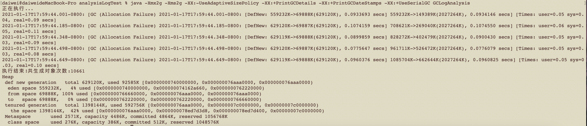

2G堆内存，这次只进行了这次只进行了5次gc 操作并且都是 young gc。但是有一点值得注意的是 2G版本产生的对象并没有1G版本产生的多。gc 的时间也有很明显增加。整体效率不如 1G版本。同时我测试了4G版本，产生的对象数和2G版基本一致，GC 次数更少，GC 时间更长。serialGC 单线程gc，内存小了容易溢出，内存大了gc 执行时间太长。

---

### ParrallelGC（并行GC）

ParallelGC + 512m

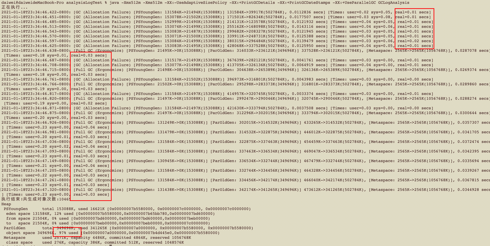

从堆内存的使用情况来看，parallelGC 对比 serialGC 使用的都是比较老的算法，在程序结束的时候也老年代的内存占用也达到了97%，和使用SerialGC 基本没有太大的差别，但是对比gc速度上来看，parallelGC 使用多线程并发收集的策略相比于同512m的serialGC 有比较大的提升。虽然parallelGC 的 gc 次数要多，由于整体STW时间的缩短，系统的吞吐也有比较明显的提升。**GC 的次数并不会直接影响系统的性能，stw暂停时间才是关键**

---

ParallelGC + 1G

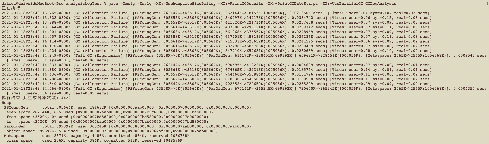

ParallelGC + 2G

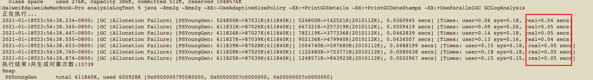

ParallelGC + 4G

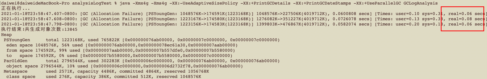

从上面的 1G，2G，4G 的执行情况可以发现，随着堆内存的放大，垃圾回收的次数明显减少，但是单次垃圾回收的时间却在明显的上升，这就导致了，放大堆内存没有并没有产生什么实质性的性能优化。**堆并不是越大越好，serialGC 和 parallelGC 在1G 到 2G 左右的空间，堆空间和GC时间会达到一个平衡点，吞吐量最大性能最优。serailGC，parallelGC 适合小堆快跑。**

---

### CMS 

CMS + 512m

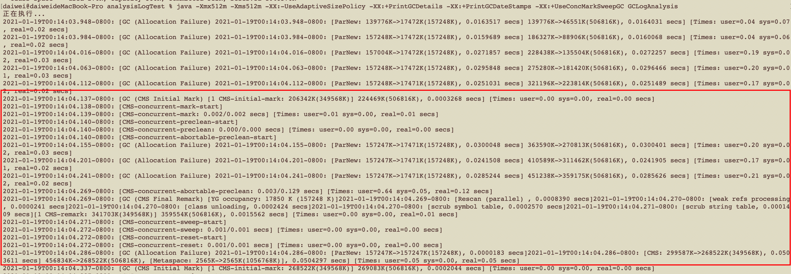

这里摘了一个CMS 周期的GC日志信息，在系统刚启动的时候，先是执行了几次young区的gc，gc速度相比于 parallelGC 稍微慢一些，和SerialGC 相当，但是随着系统运行垃圾的生成，jvm 开始了第一次old区的 CMS，开始第一次CMS 的时候 old区并没有用满。**CMS 在运行过程中会有浮动垃圾的产生，所以CMS 不可能等到 old 区满了再进行垃圾回收操作，不然在CMS执行过程中，从young晋升到old区的的对象会造成JVM的OOM。**这个CMS 的触发时机可以通过参数**-XX:+UseCMSInitiatingOccupancyOnly （CMS GC 只基于 CMSInitiatingOccupancyFraction 触发）,  -XX:CMSInitiatingOccupancyFraction （触发 CMS GC 的老年代使用阈值 ，-1 表示 CMS GC 会由 JVM 自动触发）** 进行控制。

在日志过程中能看到CMS 并发的流程过程。CMS工作过程中分6个阶段分别是：*初始标记（Initial Mark）， 并发标记（concurrent-mark） ，并发预清理（concurrent-preclean，concurrent-abortable-preclean），最终标记（Final Remark），并发清理（concurrent-sweep），重制（concurrent-reset）*。其中**Inital Mark 和 Final Remark 会导致STW**。其余的阶段都是并发执行的，所以CMS对比ParallelGC STW 时间减短了，但CMS 整个回收周期却拉长了，如果频繁的进行CMS GC，那会造成cpu 的部分负载去做垃圾回收，jvm 整体性能下降，甚至在极端情况下，CMS 并发失败会使用 Serial GC 来进行垃圾回收。CMS 在每次gc 完成后，默认不会进行内存整理操作，易产生内存碎片。

---

CMS + 1G

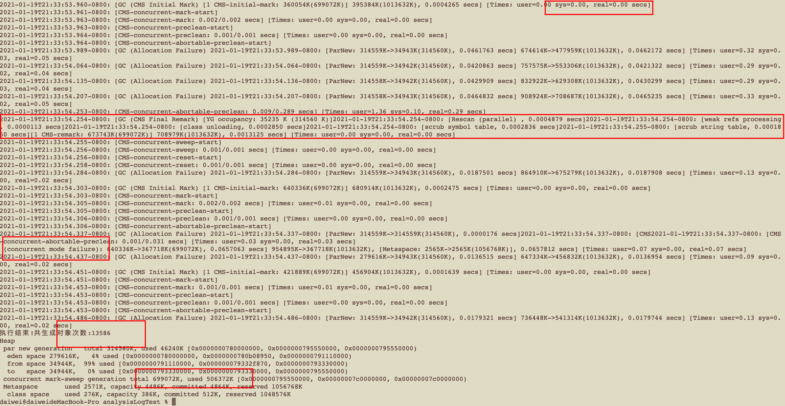

在堆大小为 1g 的场景下，之前测得 parallelGC 生成对象 14000+ ，CMS 如上图 13500+，且最后CMS 并发启动失败，退化为 serial old 进行垃圾回收，并且造成 70 ms 的暂停时间，且最终执行完成 parallelGC old区使用了 59%，但CMS 的old区使用了 72.4%，由此可见，同样 1G 的堆空间下，parallelGC 对比 CMS 不仅仅有更高的吞吐量，还有这更高的空间利用率。对比parallelGC，CMS 也不是完全没有优势的。CMS 运行期间，收集老年代的stw时间 ~=0，所以 CMS 对old区的stw 时间的控制是非常优秀的。

---

CMS + 2G

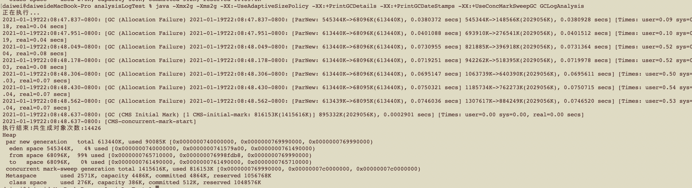

CMS + 4G

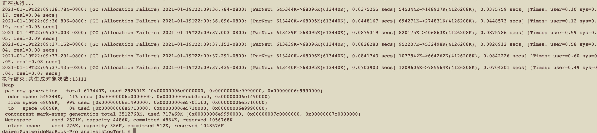

cms + 2g 和 cms + 4g 也出现了随着堆空间的增大，parNew 执行时间变长的问题。同样大小的young区，对比parallelGC，parNew 的单次young gc停顿时间也更长。但是 young 区并没有随着堆空间变大而变大，所以parNew 的gc时间不会随着堆空间的变大而变长。所以 CMS 更适合大堆，young gc回收表现也更加稳定。

---

### G1

G1 + 512m

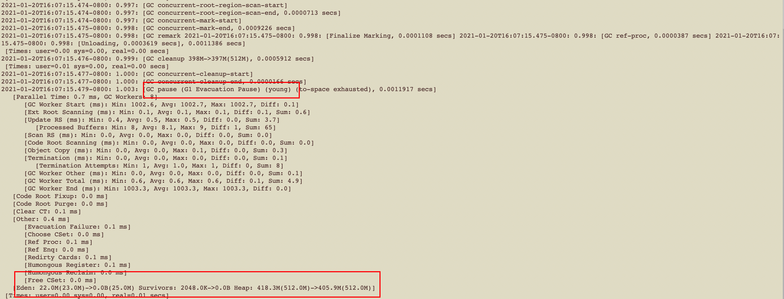

图中是一次G1 垃圾回收的记录，G1 的垃圾回收和CMS的垃圾回收过程类似，可以看到在完成了并发清理后， G1开始暂停，8个线程开始并发清理，这次GC仅清理young区。中间的部分是G1打印出来的GC 日志信息，包含GC的各个阶段和GC的时间。在 G1 + 512的配置下，也能生成 10000+ 次对象。在小内存下，G1也有不错的垃圾回收效率和GC时间控制。

G1 + 1G

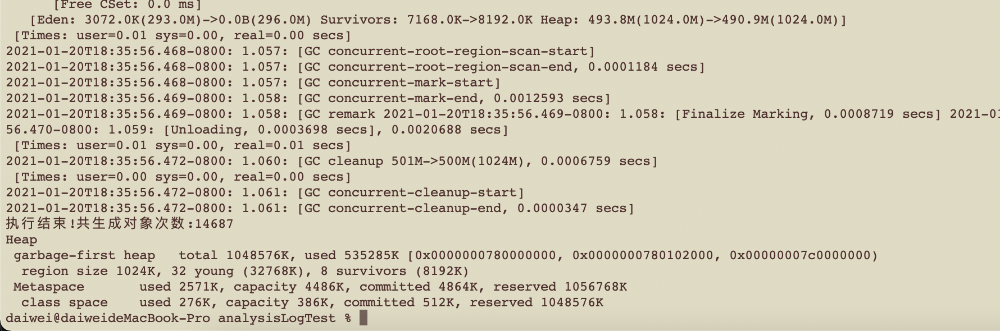

G1 + 2G

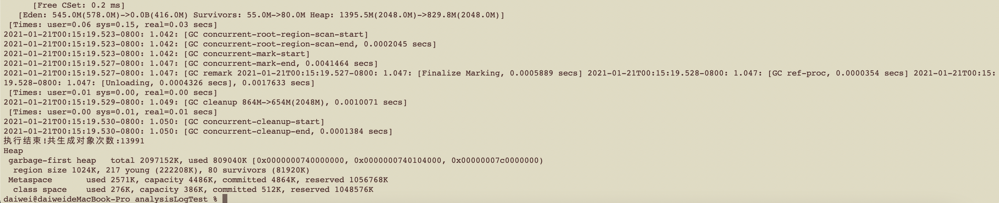

G1 + 4G

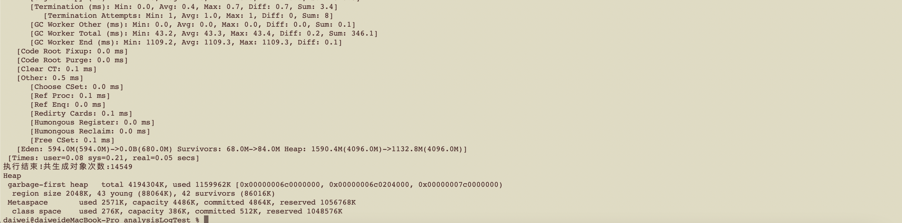

通过测试不难看出，因为 G1采用更先进的GC 回收策略，G1 在不同堆大小的场景下都有不错的表现。并不会像 parallelGC 随着堆空间的变大GC 时间变长。

## 总结

serialGC（串行GC）：young 区和old 区都是串行GC，单次GC的STW时间较长，吞吐量较低，不建议使用。

parallelGC（并行GC）：parallelGC 是多线程并行进行GC效率最高，GC时会暂停所有业务STW时间较长。因为GC是并行执行STW比serialGC短，业务整体吞吐量很较优秀。但是由于ParalleGC没有进行GC算法层面的优化，STW时间会随着堆空间的变大而增加。

CMS：cms 的 young区采用 parNew 垃圾回收器，也就是 serialGC 的多线程版本，old区使用的是 cms 垃圾回收器，cms 工作过程分为6个阶段，只有在 initial remark 阶段 和 final remark 阶段会 STW ，其余阶段都是并发的处理，所以CMS暂停时间短。parNew 垃圾回收器也同样存在，STW暂停时间随着堆空间变大而增加的问题，但是 采用 cms GC 策略的young区的大小和整个堆空间大小无关，只和CMS gc 并发线程数有关。CMS 的老年代使用的标记-清除算法，每次 gc 后不会立即整理堆空间，所以，老年代会存在比较多的空间碎片，空间利用率比较低，CMS 执行过程中会占用一定的cpu资源进而影响到业务的吞吐量。如果并发失败，CMS 将会退化为serial old，停顿会进一步延长。所以CMS并不是那么完美，再带来优秀的暂停时间的同时也带来了很多的问题，它更像是G1的测试版。

G1:是一款非常优秀的垃圾回收器，G1 将内存分为1024块小块，每一块小块都可能为新生代或老年代，在GC的时候会对年轻代和部分老年代（垃圾占比比例高）进行GC。G1的 gc 算法和 CMS 类似但更像是升级版的CMS，有着更优秀暂停时间控制和更先进的GC算法。因此，GC 在小堆和大堆都有比较好的表现，尤其是大堆性能非常优秀，堆越大对比其他的垃圾回收器越优秀。

综上所属，在堆比较小的场景下（512m～4g）推荐使用 parallelGC，在堆比较大的场景下推荐使用 G1。